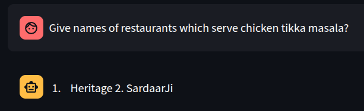
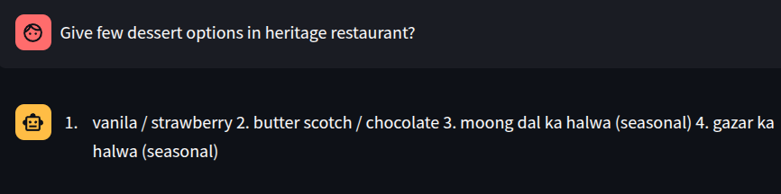
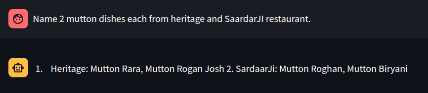
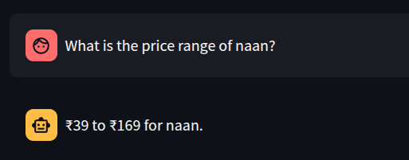
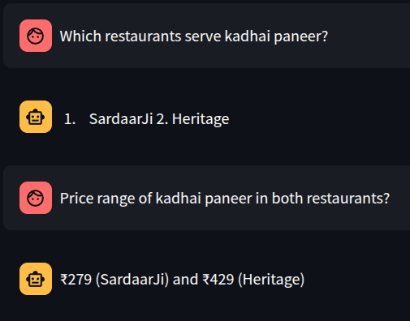
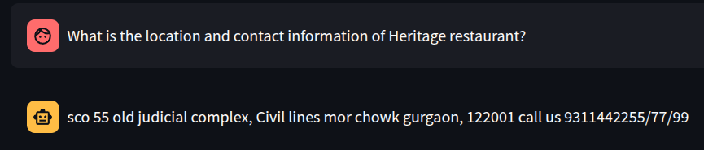
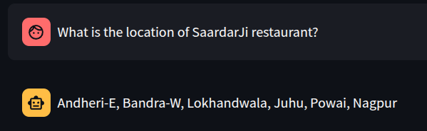
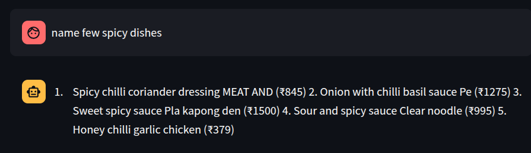

# Foodie-AI   
Web-Scraping ➜ JSON Knowledge Base ➜ FAISS ➜ Chatbot (Streamlit UI)

A full-stack Generative-AI demo that lets users ask natural-language questions about real restaurant menus and instantly receive accurate, contextual answers.

---

## Restaurant Websites Used

- [Heritage](https://www.heritagegurgaon.in)
- [Thai Pavilion](https://www.tajhotels.com/en-in/hotels/taj-city-centre-gurugram/restaurants/thai-pavilion-gurugram)
- [SardaarJI](https://sardaarjirestaurant.com/menu.html)


---

## Workflow

1. **Web Scraping**  
   • Extract restaurant name, location, and contact info from the website using Selenium  
   • Download menu PDFs from restaurant websites

2. **Menu Parsing**  
   • Parse PDF using `pdfplumber` and `re`  
   • Normalize dish text and clean symbols/units  
   • Convert each menu item to a structured JSON record (as per schema)

3. **Vector Embedding**  
   • Generate embeddings using `all-MiniLM-L6-v2` (384-dimensions)  
   • Store vectors in FAISS index  

4. **RAG Pipeline**  
   • Use FAISS to retrieve relevant JSON dishes for a user query  
   • Feed retrieved context to `mistralai/Mistral-7B-Instruct-v0.3`  
   • Display chatbot response in Streamlit UI

---

## Key Features
| Layer | Tech | Highlights |
|-------|------|------------|
| Web scraping | **Selenium** | • Headless Chrome<br>• Downloads PDF menus automatically<br>• Extracts *name, location, contact* from page DOM |
| Parsing | **pdfplumber**, `re` | • Parses every menu page-by-page<br>• Cleans text, normalises rupee symbols & units<br>• Saves one JSON record *per dish* (schema below) |
| Vector Embedding | **all-MiniLM-L6-v2** + **FAISS** | • 384-dimensional embeddings (1 JSON = 1 vector)<br>• Mapped metadata for fast filtering (by restaurant / category) |
| LLM & RAG | **mistralai/Mistral-7B-Instruct-v0.3** | • Retrieval Augmented Generation pipeline<br>• Caches conversation state in Streamlit session |
| UI | **Streamlit** | • Chat-style interface with Markdown rendering<br> |

---

##  JSON Schema

```jsonc
{
  "name": "CHICKEN TIKKA BUTTER MASALA",
  "description": "TRADITIONAL CHICKEN TIKKA PCS COOKED WITH THICK SPICY AND BUTTER GRAVY",
  "price": "499",
  "category": "Main Course",
  "restaurant_name": "HERITAGE",
  "contact": "call us 9311442255/77/99",
  "location": "sco 55 old judicial complex, Civil lines mor chowk gurgaon, 122001"
}
```

## Directory Info
```bash
chatbot_images/    # contains conversation images
data/              # menus items stored in json
menus/             # menu pdfs acquired through webscraping
```

---

## Conversation Images
### Menu Queries
<p align="center" style="margin-bottom:24px;">
  
  <br>
  <em>CTM serving restaurants</em>
</p>

<p align="center" style="margin-bottom:24px;">
  
  <br>
  <em>Desert options in a Restaurant</em>
</p>

<p align="center" style="margin-bottom:24px;">
  
  <br>
  <em>Mutton dishes accross Restaurants</em>
</p>


### Price Queries
<p align="center" style="margin-bottom:24px;">
  
  <br>
  <em>Naan prices accross restaurants</em>
</p>

<p align="center" style="margin-bottom:24px;">
  
  <br>
  <em>Kadhai paneer prices accross restaurants</em>
</p>

### Location And contact Queries
<p align="center" style="margin-bottom:24px;">
  
  <br>
  <em>Heritage Location</em>
</p>

<p align="center" style="margin-bottom:24px;">
  
  <br>
  <em>SaardarJI Location</em>
</p>

### Taste Queries
<p align="center" style="margin-bottom:24px;">
  
  <br>
  <em>Spicy Dishes</em>
</p>

## Demo Video
[Watch Demo Video](https://drive.google.com/file/d/1xdi5OksefveFbndXtnSeIxQaGl5THyn0/view?usp=drive_link)
